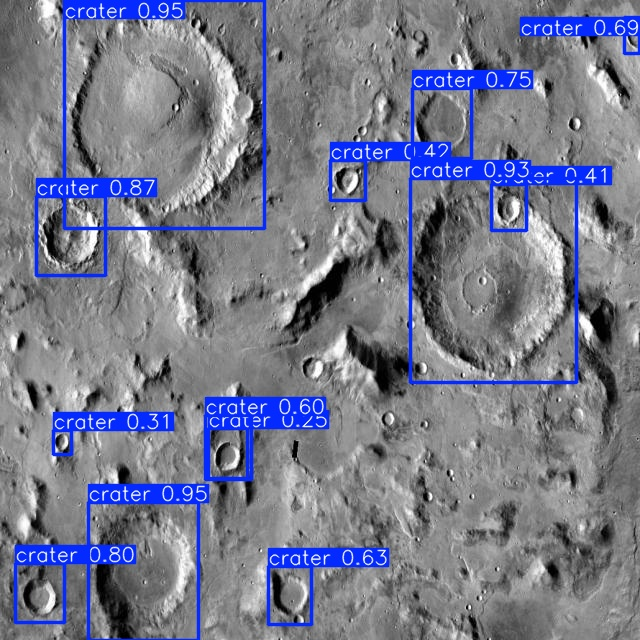
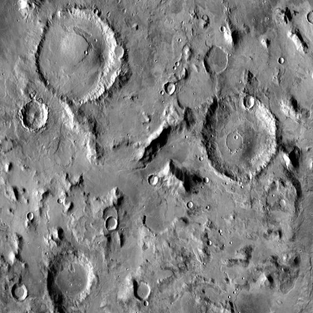
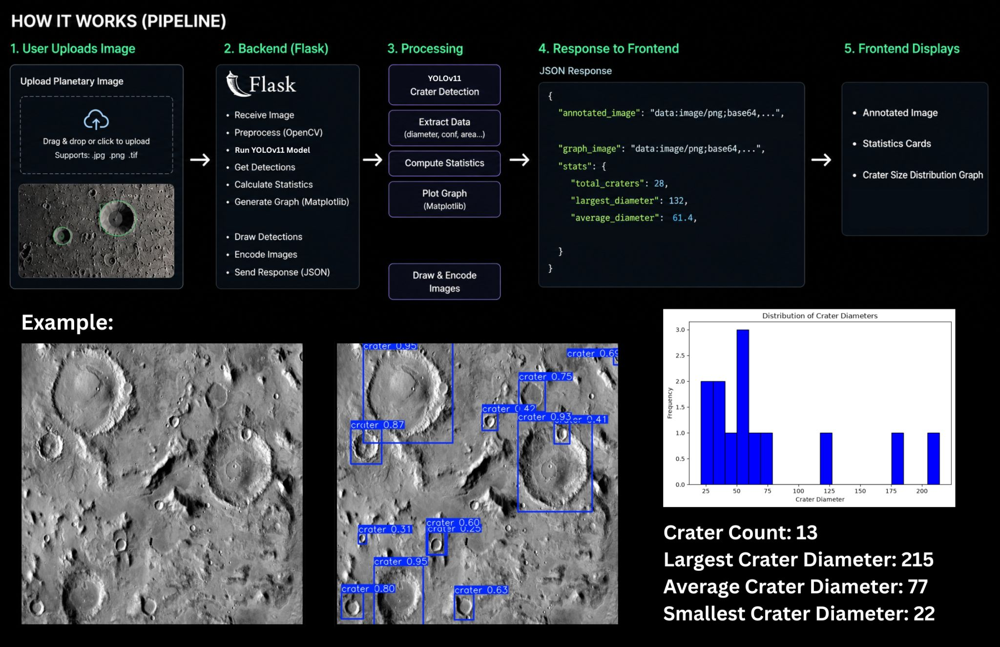

# Atlas — Planetary Surface Analysis System

Atlas is a web application for automated crater detection and analysis on planetary surface imagery. Upload an image of a lunar or Martian surface, and Atlas detects craters using a custom-trained YOLO model, then returns an annotated image along with size statistics and a distribution histogram.

## Features

- **Crater detection** on uploaded surface images using a fine-tuned YOLO11 model
- **Annotated image output** with bounding boxes drawn around detected craters
- **Crater statistics**: total count, largest diameter, smallest diameter, and average diameter
- **Diameter distribution histogram** generated for each analyzed image
- Simple REST API with a React frontend

## Tech Stack

**Backend**
- Python, Flask, Flask-CORS
- [Ultralytics YOLO](https://github.com/ultralytics/ultralytics) (YOLO11) for object detection
- OpenCV for image decoding and processing
- Matplotlib for histogram generation
- NumPy

**Frontend**
- React + Vite

**Model**
- Base model: `yolo11n.pt`
- Fine-tuned on the [Martian/Lunar Crater Detection Dataset](https://www.kaggle.com/datasets/lincolnzh/martianlunar-crater-detection-dataset) (Kaggle)

## Project Structure

```
atlas/
├── backend/
│   ├── app.py                  # Flask API server
│   ├── requirements.txt        # Python dependencies
│   └── runs/
│       └── detect/
│           └── runs/
│               └── crater_detector/
│                   └── weights/
│                       └── best.pt   # Trained YOLO model weights
└── frontend/
    └── ...                     # React + Vite app
```

## Getting Started

### Backend Setup

```bash
cd backend
python -m venv venv
source venv/bin/activate   # On Windows: venv\Scripts\activate

pip install -r requirements.txt

python app.py
```

The backend will start on `http://localhost:8600`.

### Frontend Setup

```bash
cd frontend
npm install
npm run dev
```

## API Reference

### `POST /detect`

Detects craters in an uploaded image and returns annotated results with size statistics.

**Request**

`multipart/form-data` with a single field:

| Field | Type | Description |
|-------|------|-------------|
| `image` | File | The surface image to analyze (JPEG/PNG) |

**Response**

```json
{
  "crater_count": 42,
  "largest_crater_diameter": 187,
  "average_crater_diameter": 56,
  "smallest_crater_diameter": 12,
  "annotated_image": "<base64-encoded JPEG>",
  "histogram": "<base64-encoded PNG>"
}
```

| Field | Description |
|-------|-------------|
| `crater_count` | Total number of craters detected |
| `largest_crater_diameter` | Diameter (px) of the largest detected crater, rounded up |
| `average_crater_diameter` | Average diameter (px) across all detected craters, rounded up |
| `smallest_crater_diameter` | Diameter (px) of the smallest detected crater, rounded up |
| `annotated_image` | Base64-encoded JPEG of the input image with bounding boxes drawn |
| `histogram` | Base64-encoded PNG of the crater diameter distribution histogram |

Diameter is estimated as the average of each bounding box's width and height, in pixels.

**Errors**

| Status | Condition |
|--------|-----------|
| `400` | No `image` field present in the request |

## Model Training

The detection model started from Ultralytics' `yolo11n.pt` checkpoint and was fine-tuned on the [Martian/Lunar Crater Detection Dataset](https://www.kaggle.com/datasets/lincolnzh/martianlunar-crater-detection-dataset) from Kaggle, which contains labeled crater imagery from both Martian and lunar surfaces.

## Examples

<p align="center">
  
  
  
</p>
